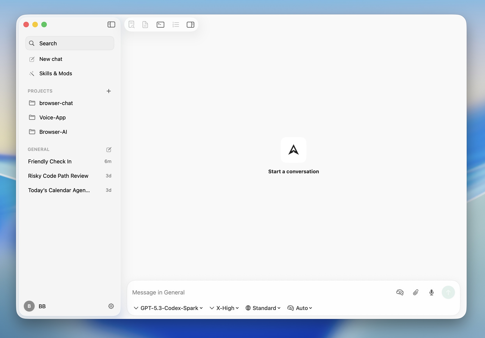
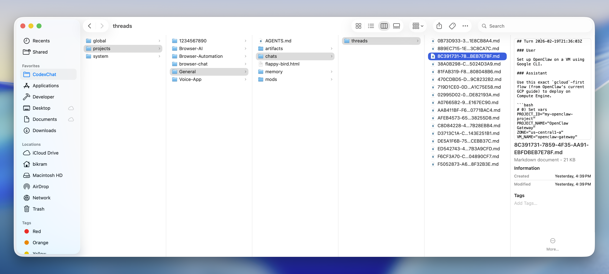
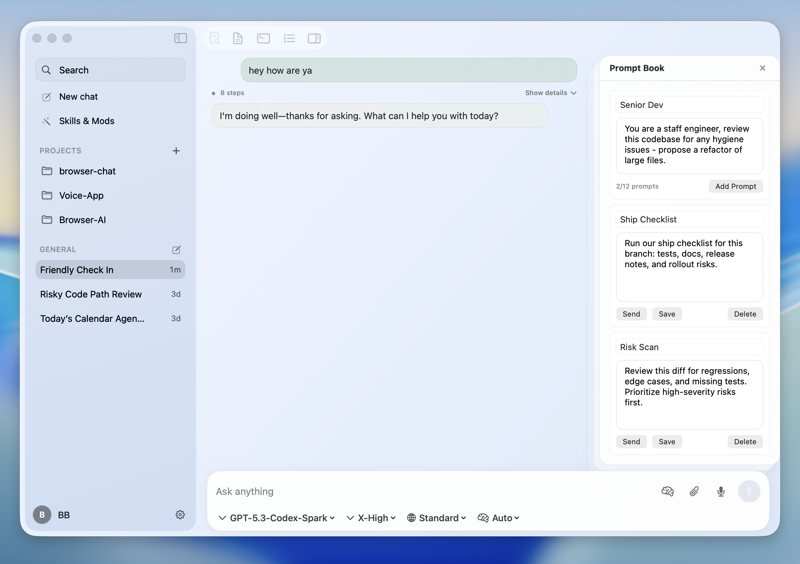
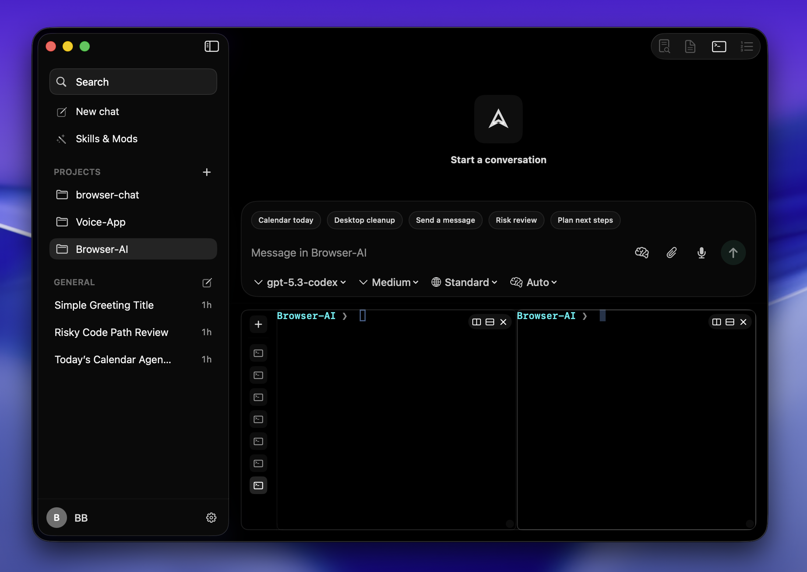

# CodexChat

CodexChat is an open-source, local-first, macOS-native Codex client built with SwiftUI.
It integrates with the local `codex app-server` runtime and is designed for safe, reviewable agent workflows against real project folders.

Core differentiators:

- Native SwiftUI macOS app (not a cross-platform web shell).
- Conversations are persisted as local Markdown files you own.
- Skills and Mods support workflow automation and deep UI customization.
- Safety controls are explicit and legible (approvals, diff review, guardrails).
- Contributor tooling is built in (`CodexChatCLI`) for reproducible diagnostics and smoke tests.

## Features

- Native SwiftUI macOS experience for the Codex runtime with a chat-first flow.
- Local Markdown memory: conversations and project context are stored on disk as editable `.md` files.
- Theme customization with tunable palette, surface, text, and accent colors.
- Mods and Mods Bar support UI/workflow customization and side helpers while chatting.
- Built-in terminal workspace with multi-shell support for command-first and agent-assisted execution.
- Skill workflows: install from skills.sh or create and save your own, then trigger with `$` shortcuts.
- Native macOS actions (calendar, messages, desktop cleanup) with preview-first confirmations and safety controls.
- Project safety controls for sandbox mode, approval policy, network access, and web search.
- Chat archive persistence with searchable local metadata.
- Keychain-backed secret handling for API keys.
- Deterministic contributor workflows via CLI diagnostics and fixtures.

## Screenshots

### Codex Chat (Default)


### Local Conversation Memory


### Theme Switching


### Mods + Prompt Bar


### Terminal Workspace


## Repository Layout

- `apps/CodexChatHost`: canonical GUI app target (`com.codexchat.app`) and release source.
- `apps/CodexChatApp`: shared app/runtime module (`CodexChatShared`) and `CodexChatCLI`.
- `packages/*`: modular Swift packages (`Core`, `Infra`, `UI`, `CodexKit`, `Skills`, `Memory`, `Mods`, `Extensions`).
- `skills/first-party`: tracked first-party skill templates (including personal-action playbooks for macOS workflows).
- `tests/fixtures`: shared fake runtime fixtures used by smoke/integration paths.

## Requirements

- macOS 14+
- Xcode 16+ (Swift tools `6.0`)
- Node 22+
- Homebrew
- SwiftFormat, SwiftLint, gitleaks

## Quick Start

```sh
bash scripts/bootstrap.sh
```

Run the canonical GUI:

```sh
open apps/CodexChatHost/CodexChatHost.xcodeproj
```

Use scheme `CodexChatHost`.

## Contributor Commands

### Fast validation

```sh
make quick
```

Runs metadata/parity checks, format check, lint, and fast tests.

### OSS smoke checks

```sh
make oss-smoke
```

Runs deterministic contributor smoke checks using `CodexChatCLI`.

### Team A local reliability harness

```sh
make reliability-local
```

Runs deterministic runtime/data reliability suites (recovery, mapping, approvals, durability).

Generate a reliability scorecard artifact:

```sh
make reliability-scorecard
```

Writes markdown + JSON scorecard outputs under `.artifacts/reliability/`.
Includes deterministic repro fixtures for `basic-turn`, runtime-termination recovery, and stale-thread remap.

### Local pre-push gate

```sh
make prepush-local
```

Runs `quick`, targeted smoke, and Team A reliability harness before push.

Install an optional local `pre-push` hook:

```sh
make install-local-hooks
```

### Full build + test validation

```sh
pnpm -s run check
```

Builds and runs full Swift test suites.

### CI-equivalent local flow

```sh
make ci
```

Runs the full local CI gate sequence.

### Headless diagnostics and reproducible fixtures

```sh
cd apps/CodexChatApp
swift run CodexChatCLI doctor
swift run CodexChatCLI smoke
swift run CodexChatCLI repro --fixture basic-turn
swift run CodexChatCLI repro --fixture runtime-termination-recovery
swift run CodexChatCLI repro --fixture stale-thread-remap
swift run CodexChatCLI replay --project-path <project-path> --thread-id <thread-uuid> --json
swift run CodexChatCLI ledger export --project-path <project-path> --thread-id <thread-uuid>
swift run CodexChatCLI policy validate --file ../../config/runtime-policy/default-policy.json
```

### Release packaging

```sh
make release-dmg
```

Builds signed/notarized DMG artifacts when signing credentials are configured.

## Test Layout

- App-level tests: `apps/CodexChatApp/Tests/CodexChatAppTests`
- Package-level tests: `packages/*/Tests`
- Root `tests/`: shared fixtures and cross-package integration assets (not the primary home of unit tests)

## Design Constraints

- Conversation-first UI with a stable two-pane layout.
- No persistent third pane in current releases.
- Accessibility and explicit safety controls are mandatory.

## Documentation

- `CONTRIBUTING.md`
- `docs-public/README.md`
- `docs-public/INSTALL.md`
- `docs-public/ARCHITECTURE_CONTRACT.md`
- `docs-public/SECURITY_MODEL.md`
- `docs-public/MODS.md`
- `docs-public/MODS_SHARING.md`
- `docs-public/PERSONAL_ACTIONS.md`
- `docs-public/DEVELOPER_AGENT_WORKFLOWS.md`
- `docs-public/RELEASE.md`

## Validation Reference

```sh
make quick
make oss-smoke
make reliability-local
make reliability-scorecard
pnpm -s run check
```

## License

MIT. See `LICENSE`.
